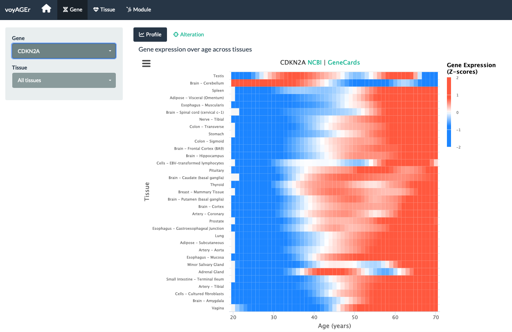

# voyAGEr

> **Original article:**
>
> Arthur L. Schneider, Rita M. Silva, Alexandre Kaizeler, Nuno Saraiva-Agostinho and Nuno L. Barbosa-Morais (2023). voyAGEr: free web interface for the analysis of age-related gene expression alterations in human tissues. *eLife*.

voyAGEr is a web interface for the analysis of age-related gene expression alterations in GTEx human tissues. The app leverages RNA-seq datasets from the GTEx project (Lonsdale et al., 2013), encompassing tissue samples from hundreds of donors aged from 20 to 70 years.

voyAGEr is composed of four main sections (the tabs in the navigation bar at the top):

-   `Home` (depicted by the home icon): to visually explain the used method and its associated findings featured in the application.

-   `Gene`: to lead a gene-centric investigation, namely to assess how the expression of a specific gene changes with age and sex in a specific tissue.

-   `Tissue`: to analyse how tissue-specific transcriptomes change with age and sex.

-   `Module`: to further examine sets of co-expressed genes whose expression is altered with age namely through their enrichment in specific cell types, biological pathways and association with diseases.

## Web App Hosting

voyAGEr is freely available at <https://compbio.imm.medicina.ulisboa.pt/app/voyAGEr>

## Tutorials

-   [Web App Tutorial](https://diseasetranscriptomicslab.github.io/voyAGEr/www/voyAGEr-WebAppTutorial.html)

## Install and start running

Please take into account that, in order to run voyAGEr's Shiny app, you must have previously run the pre-processing pipeline on GTEx count data and metadata (with restricted access).

### R Studio

To download the repository from GitHub to R Studio, please run the following commands:

´´´r

# set working directory
setwd(dir = "path/to/download/repository")

# download .zip file of the repository
# from the "Clone or download - Download ZIP" button
download.file(url = "<https://github.com/DiseaseTranscriptomicsLab/voyAGEr/archive/refs/heads/main.zip>" , 
              destfile = "voyAGEr.zip")

# unzip the .zip file
unzip(zipfile = "voyAGEr.zip")

# set the working directory
# to be inside the newly unzipped folder

setwd(dir = "voyAGEr-main/")

´´´

After downloading the .zip file of the repository, please make sure you have installed the following libraries in your RStudio (and if you don't, install them with the `install.library("libraryname")` command):

`shiny`, `shinythemes`, `shinyWidgets`, `highcharter`, `shinycssloaders`, `manipulateWidget`, `fontawesome`, `viridis`, `RSQLite`, `tm`, `reshape2`, `plyr`, `htmltools`, `RColorBrewer`, `shinyBS`

Finally, to launch the app, run the following commands:
source("ui.R") source("server.R")

´´´r
# To load scripts
source("ui.R") 
source("server.R")
# To launch app
runApp()
´´´

### Docker 

1. Download GitHub repository to your computer:

´´´bash

wget("https://github.com/DiseaseTranscriptomicsLab/voyAGEr/archive/refs/heads/main.zip")

´´´

2. Generate docker image:

´´´bash

docker build . -t arthurschneider/voyager

´´´

## Feedback and support

If you have any feedback or questions, please feel free to open an Issue in this GitHub repository, or contact us through the following emails:

> Rita Martins-Silva ([rita.silva\@medicina.ulisboa.pt](mailto:rita.silva@medicina.ulisboa.pt))
>
> Alexandre Kaizeler ([alexandre.afonso\@medicina.ulisboa.pt](mailto:alexandre.afonso@medicina.ulisboa.pt))

[Disease Transcriptomics Lab](https://imm.medicina.ulisboa.pt/group/distrans), 2023
